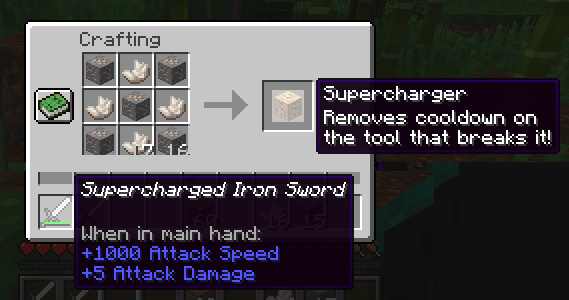

<h1 align="center">
  🌞
  <br/>
  supercharge
</h1>

<h2 align="center">
  remove cooldown bar from any minecraft tool
</h2>

<p align="center">
  <a href="https://github.com/insanj/supercharge/releases">
    
    
  </a>

  <a href="https://github.com/insanj/supercharge/">
    
  </a>

  <br/>

  <a href="https://github.com/insanj/supercharge/blob/master/LICENSE">
    
  </a>

  <a href="https://jdk.java.net/">
    
  </a>

  <a href="https://fabricmc.net/use/">
    
  </a>

  <a href="https://maven.fabricmc.net/net/fabricmc/fabric/">
    
  </a>

  <a href="https://minecraft.curseforge.com/projects/supercharge-fabric">
    
  </a>
</p>

<br/>
<br/>

<h2 align="center">
  How to Play
</h2>

<p align="center">
  
  
</p>

<br/>

<h2 align="center">
Requirements
</h2>

1. Make sure [Fabric](https://fabricmc.net/wiki/install) is already installed on your Minecraft client. I recommend using the Vanilla launcher.
2. Once the Fabric launcher is installed, get the [Fabric API](https://minecraft.curseforge.com/projects/fabric), which powers Fabric mods, and place it in your `mods/` folder (appears after running Fabric from the Minecraft launcher for the first time).
3. To see enabled mods, install [Mod Menu](https://minecraft.curseforge.com/projects/modmenu), which adds a button on the start screen and pause menu.

<br/>

<h2 align="center">
How to Build
</h2>

```
cd plugin && ./gradlew build
```

Depending on your machine, you may have to run `gradle` or the `gradlew.bat` file locally to setup the gradle wrapper.

<br/>

<h2 align="center">
Acknowledgements
</h2>

Forked from [viridian](https://github.com/insanj/viridian), which itself was a fork of [ASH - Another Simple HUD](https://minecraft.curseforge.com/projects/ash-another-simple-hud). Many thanks to the following open source projects which helped quite a lot as well:

- [Player Graves](https://github.com/NerdHubMC/Player-Graves)
- [FabricMC's Yarn](https://github.com/FabricMC/yarn/) & [API](https://github.com/FabricMC/fabric)
- [Dinnerbone's Resource Pack API](https://gist.github.com/Dinnerbone/5662824)
- [ShulkerBoxTooltip](https://github.com/MisterPeModder/ShulkerBoxTooltip/)
- [Denizen](https://github.com/mcmonkey4eva/Denizen)

<br/>

<h2 align="center">
Authors
</h2>

<p align="center">
  (c) 2019 Julian Weiss (insanj). Made with 💚 in Brooklyn. <a href="http://insanj.com">insanj.com</a>.
</p>

<br/>

<h2 align="center">
License
</h2>

### [supercharge](https://github.com/insanj/supercharge)

```
MIT License

Copyright (c) 2019 Julian Weiss & Anna Raykovska

Permission is hereby granted, free of charge, to any person obtaining a copy
of this software and associated documentation files (the "Software"), to deal
in the Software without restriction, including without limitation the rights
to use, copy, modify, merge, publish, distribute, sublicense, and/or sell
copies of the Software, and to permit persons to whom the Software is
furnished to do so, subject to the following conditions:

The above copyright notice and this permission notice shall be included in all
copies or substantial portions of the Software.

THE SOFTWARE IS PROVIDED "AS IS", WITHOUT WARRANTY OF ANY KIND, EXPRESS OR
IMPLIED, INCLUDING BUT NOT LIMITED TO THE WARRANTIES OF MERCHANTABILITY,
FITNESS FOR A PARTICULAR PURPOSE AND NONINFRINGEMENT. IN NO EVENT SHALL THE
AUTHORS OR COPYRIGHT HOLDERS BE LIABLE FOR ANY CLAIM, DAMAGES OR OTHER
LIABILITY, WHETHER IN AN ACTION OF CONTRACT, TORT OR OTHERWISE, ARISING FROM,
OUT OF OR IN CONNECTION WITH THE SOFTWARE OR THE USE OR OTHER DEALINGS IN THE
SOFTWARE.
```

### [ash - another simple hud](https://github.com/umollu/ash)

```
MIT License

Copyright (c) 2019 umollu

Permission is hereby granted, free of charge, to any person obtaining a copy
of this software and associated documentation files (the "Software"), to deal
in the Software without restriction, including without limitation the rights
to use, copy, modify, merge, publish, distribute, sublicense, and/or sell
copies of the Software, and to permit persons to whom the Software is
furnished to do so, subject to the following conditions:

The above copyright notice and this permission notice shall be included in all
copies or substantial portions of the Software.

THE SOFTWARE IS PROVIDED "AS IS", WITHOUT WARRANTY OF ANY KIND, EXPRESS OR
IMPLIED, INCLUDING BUT NOT LIMITED TO THE WARRANTIES OF MERCHANTABILITY,
FITNESS FOR A PARTICULAR PURPOSE AND NONINFRINGEMENT. IN NO EVENT SHALL THE
AUTHORS OR COPYRIGHT HOLDERS BE LIABLE FOR ANY CLAIM, DAMAGES OR OTHER
LIABILITY, WHETHER IN AN ACTION OF CONTRACT, TORT OR OTHERWISE, ARISING FROM,
OUT OF OR IN CONNECTION WITH THE SOFTWARE OR THE USE OR OTHER DEALINGS IN THE
SOFTWARE.
```
